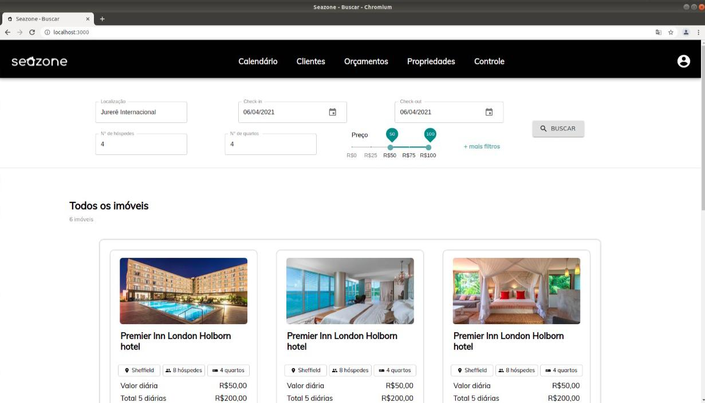
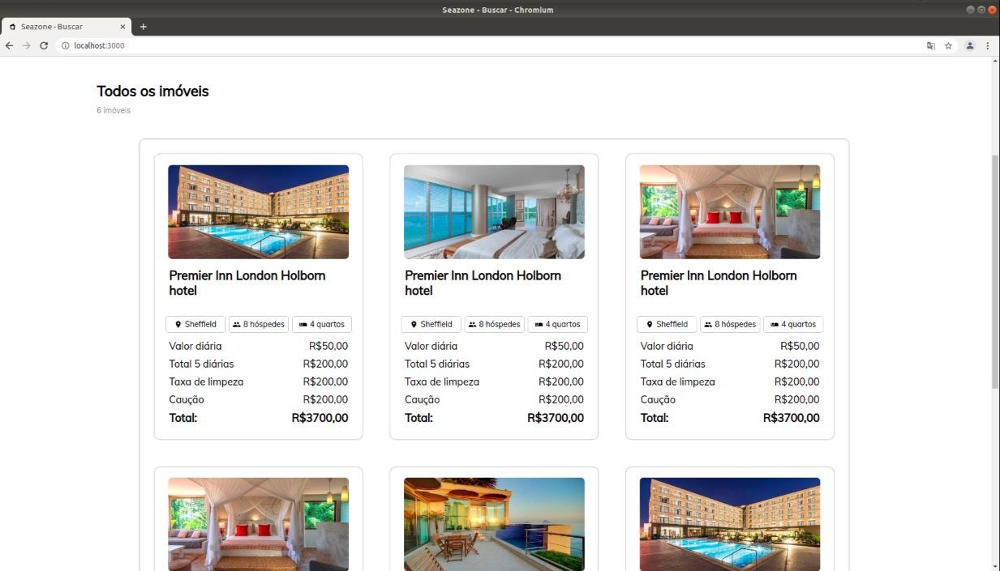
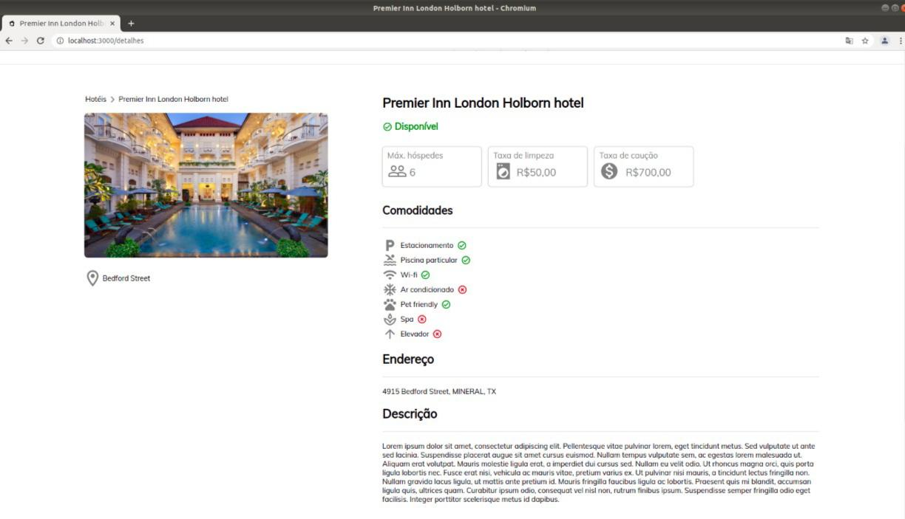
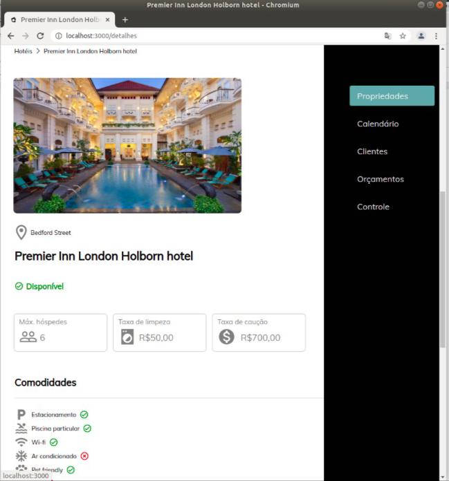
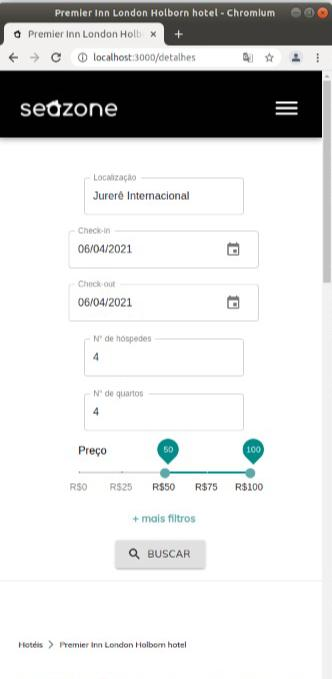

# Seazone Code Challenge 👩‍💻

Este projeto é um website desenvolvido como um desafio de front end web proposto pela [Seazone](https://seazone.com.br/). O desafio consistia em criar duas páginas de visualização e busca de imóveis
cadastrados no sistema de gerenciamento de imóveis da empresa. O resultado esperado nesse projeto não era o de um site completo com um back end, mas sim 
apenas o front end.

## O que foi usado durante o desenvolvimento? ⚙️

- HTML
- CSS
- TypeScript
- React JS
- Material UI
- Git e GitHub
- VS code

## Como é a aplicação? 🖥️
No projeto foram criadas 6 páginas. Contudo, foram
desenvolvidas duas telas: uma página de busca por imóveis que contém filtros de pesquisa e outra com os detalhes
de uma propriedade encontrada na busca. As demais estão em branco
como proposto pelo desafio. Um dos requisitos também era um cabeçalho funcional, que redireciona o usuário para outra tela quando uma 
das opções é selecionada. Para facilitar a usabilidade,
quando a resolução da tela se torna menor, uma opção de menu lateral com os links do cabeçalho original aparece.

## Qual o resultado? 🌐
### Visualizando a tela de pesquisa:

### Os detalhes de uma propriedade:

### A mesma página porém em uma tela menor:

## Rodando a aplicação 🏃‍♀️
Primeiramente, verifique se o nodeJS está instalado em seu computador. Em seguida:

- Clone esse repositório:  
**$ git clone https://github.com/AnaCrisOliver/website-challenge.git**

- Vá para a pasta do projeto no seu computador:  
**$ cd website-challenge**

- Instale as dependências:  
**$ npm install**

- Rode a aplicação:  
**$ npm start**

Dessa forma, o servidor irá abrir uma guia em algum navegador usando a porta 3000 (provavelmente). E pronto!
